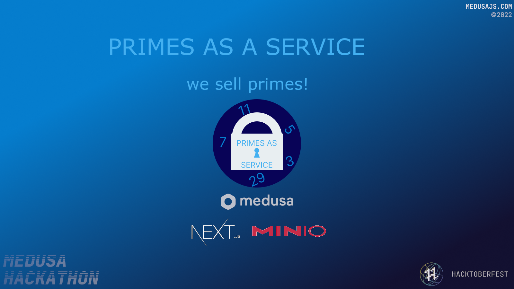
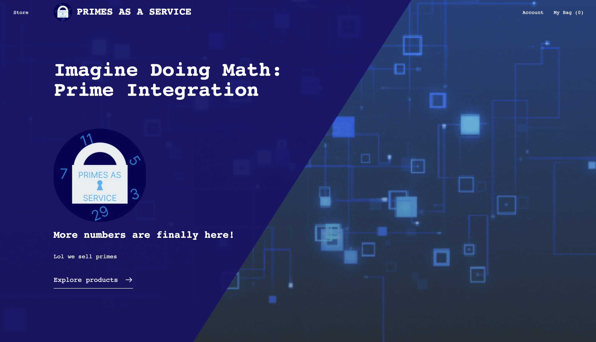
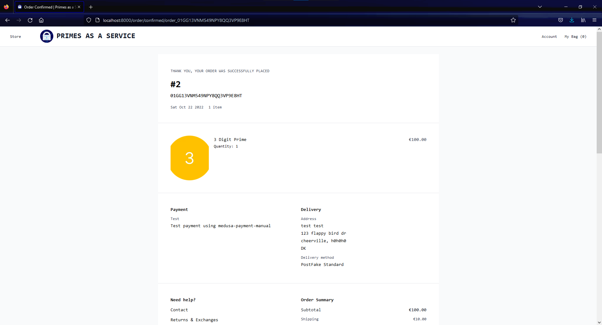
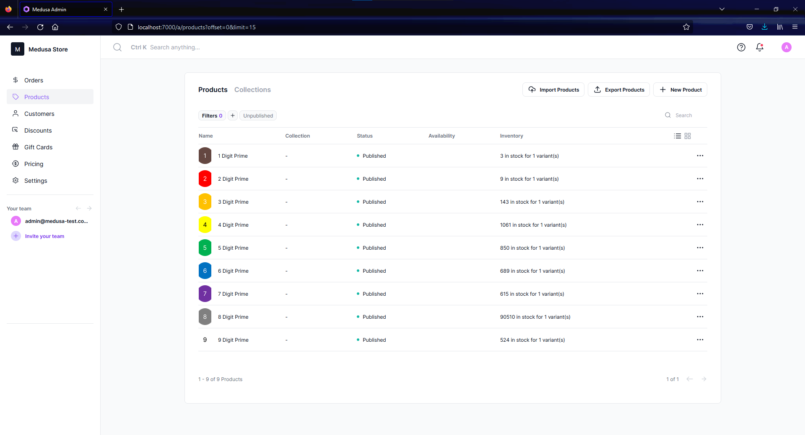
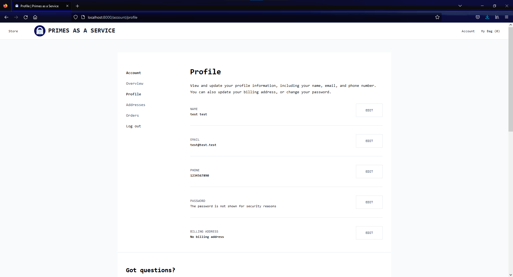
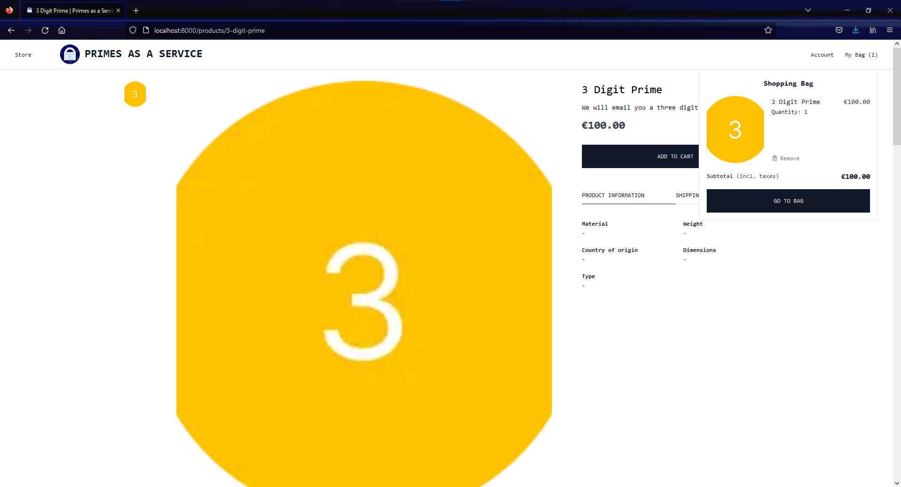
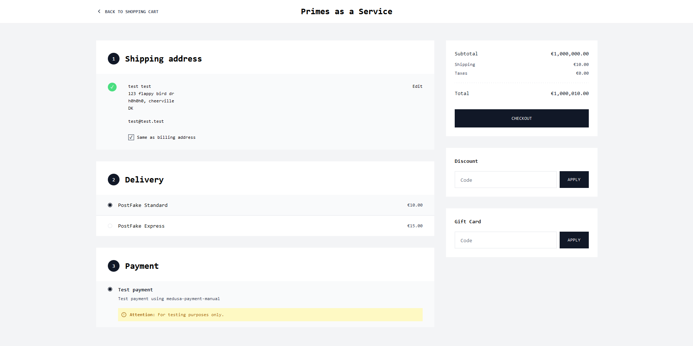
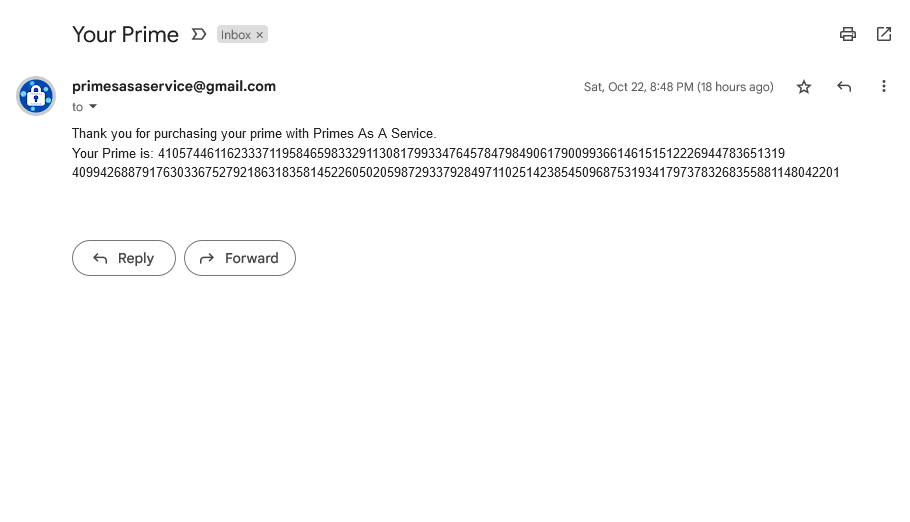

# Primes as a Service
Built with 
  
*insert demo link*

## About
### Participants
* [Alex](https://github.com/pane2004)
* [Eugene](https://github.com/Ezzhingy)
* [Jerry](https://github.com/Bobliuuu)
* [Nathan](https://github.com/Nathan13888)
* [Vivian](https://github.com/vivian-dai)

### Description

Primes as a service is a medusa store for selling prime numbers for cryptography and RSA encryption. 

### Preview

Expand to see screenshots

## Setup
### Prerequisites
* [Node.js v14 or v16](https://nodejs.org)
* [MinIO v8](https://min.io/)
* [Medusajs v15](https://medusajs.com/)
### Installation
Run `npm install` in the root folder, the `frontend` folder, and the `admin` folder  

Set up a Minio bucket, make it public and add `MINIO_ENDPOINT`, `MINIO_BUCKET`, `MINIO_ACCESS_KEY`, and `MINIO_SECRET_KEY` environment variables in the `.env` file. Check `.env.template` for what environment variables exist. `MINIO_ENDPOINT` is already configured in the `env.template`. Keep that. Refer to [Medusa.js's guide on setting up MinIO for more](https://docs.medusajs.com/add-plugins/minio/)  
Create a [Stripe](https://stripe.com) account and add your stripe API key as `STRIPE_API_KEY` in the `.env` file in root and your public key as `NEXT_PUBLIC_STRIPE_KEY` in the `.env` file in the [`frontend`](./frontend/) folder
### Running
Start MinIO:  
1. `./minio.exe server ./ --address 127.0.0.1:9001  --console-address :9090`  
Start Medusa in a new command line window:
2. `medusa develop`  
Open another instance of your command line to run frontend:
3. `cd frontend`
4. `yarn dev`  
Open yet another instance of your command line to run the admin:
5. `cd admin`
6. `npm start`

### Backedn

The backend of our app (prime generation) is a FastAPI endpoint hosted on Deta. 
You can test it out here: https://lpdet4.deta.dev/gentestprime
The docuentation is here: https://lpdet4.deta.dev/docs
An API key is required for production prime generation. 

An Azure VM hosts an email script to automate the prime checkout process. 

## Resources
* [Medusa's Github repository](https://github.com/medusajs/medusa)
* [Medusa Next.js Storefront](https://docs.medusajs.com/starters/nextjs-medusa-starter)
* [Medusa Admin](https://docs.medusajs.com/admin/quickstart/)
* [Medusa Minio](https://docs.medusajs.com/add-plugins/minio/)
* [Medusa Stripe](https://docs.medusajs.com/add-plugins/stripe/)
