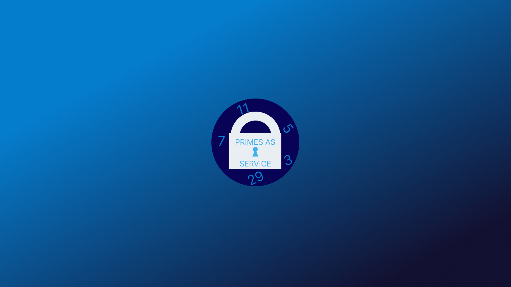
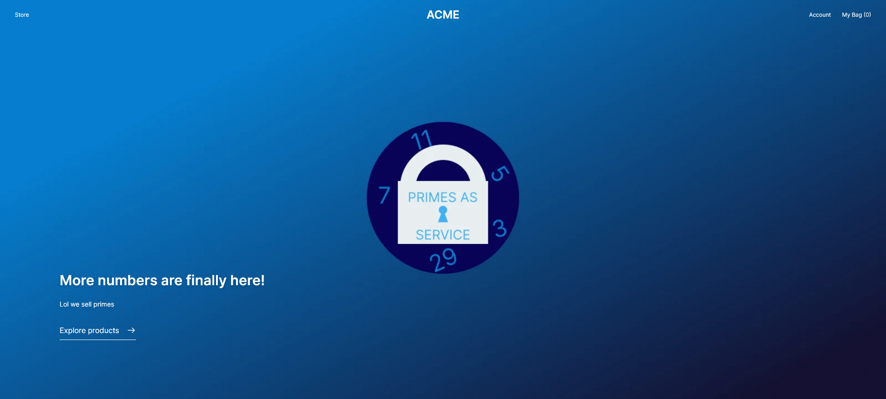

# Primes as a Service
  
*insert demo link*

## About
### Participants
* [Alex](https://github.com/pane2004)
* [Eugene](https://github.com/Ezzhingy)
* [Jerry](https://github.com/Bobliuuu)
* [Nathan](https://github.com/Nathan13888)
* [Vivian](https://github.com/vivian-dai)

### Description
We sell primes.
### Preview

## Setup
### Prerequisites
* [Node.js v14 or v16](https://nodejs.org)
### Installation
Run `npm install` in the root folder, the `frontend` folder, and the `admin` folder
### Running
1. `medusa develop`
Open another instance of your command line to run frontend:
2. `cd frontend`
3. `yarn dev`
Open yet another instance of your command line to run the admin:
4. `cd admin`
5. `npm start`

## Resources
* [Medusa's Github repository](https://github.com/medusajs/medusa)